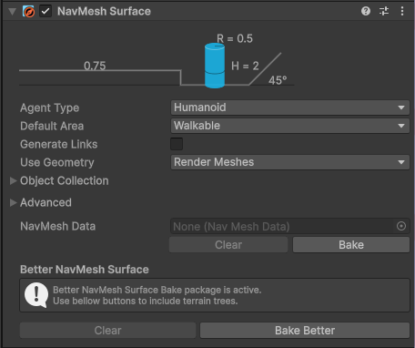

# Unity Better NavMesh Bake

A Unity package that enhances the [NavMesh Surface](https://docs.unity3d.com/Packages/com.unity.ai.navigation@2.0/manual/NavMeshSurface.html) baking process. Currently it only adds support for [Terrain](https://docs.unity3d.com/Manual/script-Terrain.html) [Trees](https://docs.unity3d.com/Manual/terrain-Trees-Landing.html).

## Usage

> [!IMPORTANT]
> You need Unity's [AI Navigation](https://docs.unity3d.com/Packages/com.unity.ai.navigation@2.0/manual/index.html) package. When you install this package, it should depend on it and install it automatically for you.

Install the package according to the [installation instructions]. Once installed, you can use the extra buttons from the *NavMesh Surface* to use this package to bake.



### What this package currently does

- Make real instances of terrain trees for baking (they get removed after baking). These trees support the following components:
  - Mesh Renderer and Mesh Filter, only used when *Use Geometry* is set to *Render Meshes*
    > [!IMPORTANT]
    > Both need a Mesh Renderer and Mesh Filter need to be on the tree.
  - Colliders of any type, can be multiple, mix and matched, only used when *Use Geometry* is set to *Physics Colliders*
  - NavMesh Modifier
  - NavMesh Modifier Volume
  > [!IMPORTANT]
  > All components above need to be enabled to be used by the NavMesh Surface.

## Installation

### Option 1: Package Manager (recommended)

Open the Package Manager window, click on `Add Package from Git URL ...`, then enter the following:

```
https://github.com/lajawi/unity-navmesh-better-bake.git
```

### Option 2: Manually Editing `package.json`

Add the following line to your project's `Packages/manifest.json`:

```json
"com.github.lajawi.betternavmeshbake": "https://github.com/lajawi/unity-navmesh-better-bake.git"
```
